# 🎬 Cinema Ticket Reservation System

A comprehensive web-based application for managing cinema ticket bookings, movie schedules, and theater operations.

---

## 📌 Project Overview

This project provides a robust platform for both customers and administrators to interact with a cinema management system. Customers can browse movies, view showtimes, and book tickets, while administrators can manage movie listings, seating arrangements, and booking records.

## 🚀 Key Features

- **User Authentication:** Secure login and registration for customers and administrators.
- **Movie Management:** Add, update, and remove movie listings with descriptions and posters.
- **Real-time Booking:** Dynamic seat selection and ticket reservation system.
- **Admin Dashboard:** Comprehensive tools for managing theater settings and viewing reports.
- **Responsive Design:** Optimized for a seamless experience across various devices.

## 🛠️ Technologies Used

- **Backend:** Java, JSP (JavaServer Pages), Servlets
- **Frontend:** HTML5, CSS3, JavaScript
- **Database:** MySQL
- **Build Tool:** Ant (build.xml present)

---

## 📸 Screenshots

Below are some visual highlights of the system's interface:

<div align="center">
  <h3>🏠 Home & Navigation</h3>
  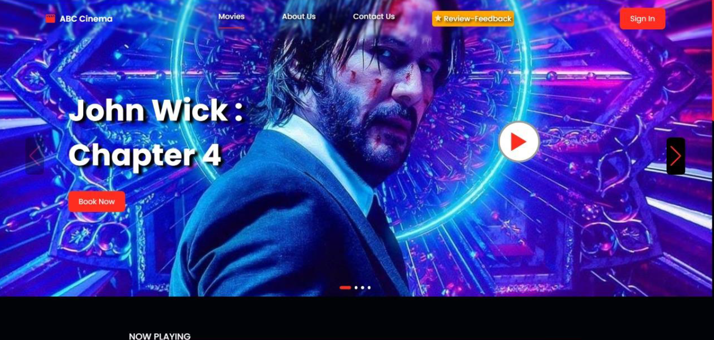
  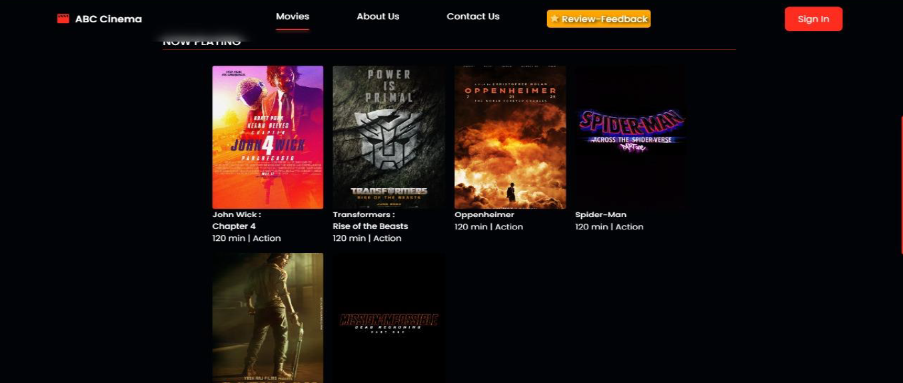
  
  <h3>🎟️ Booking Flow</h3>
  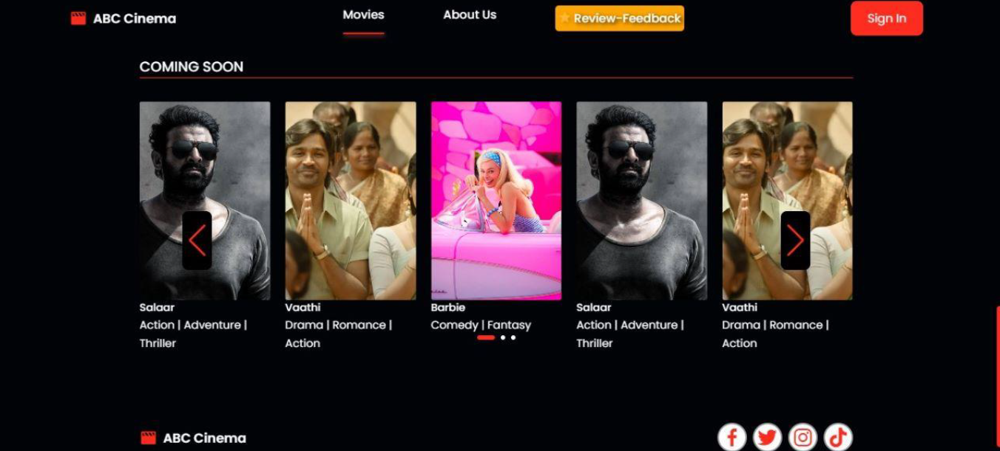
  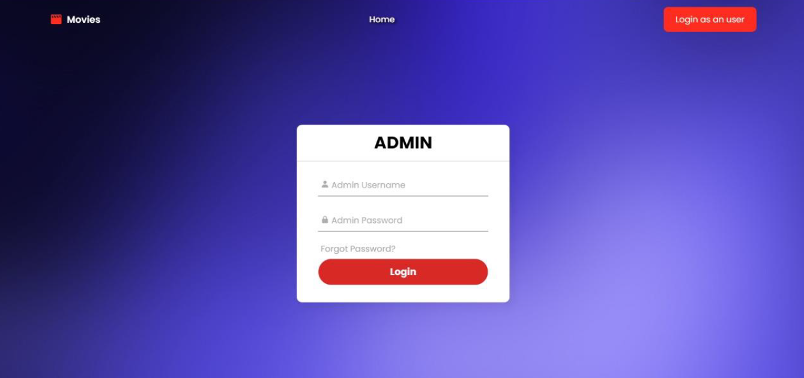
  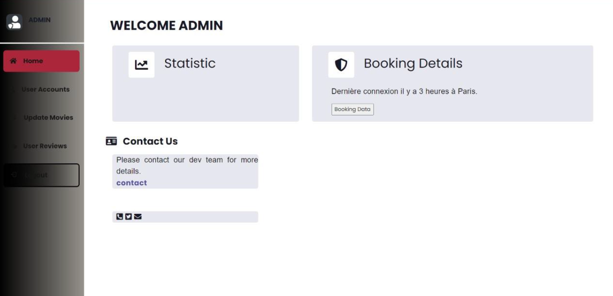
  
  <h3>👤 User Experience</h3>
  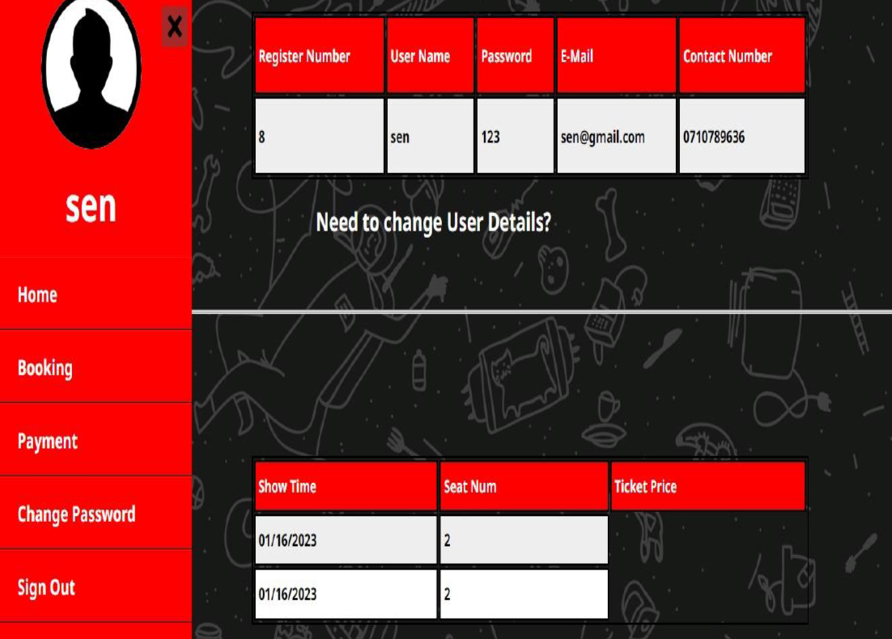
  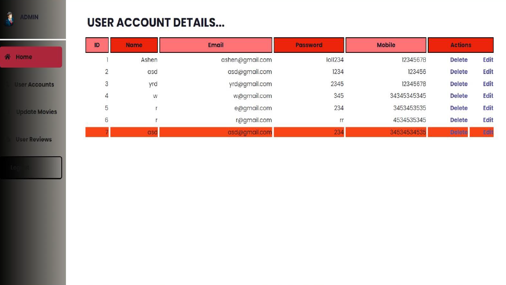
  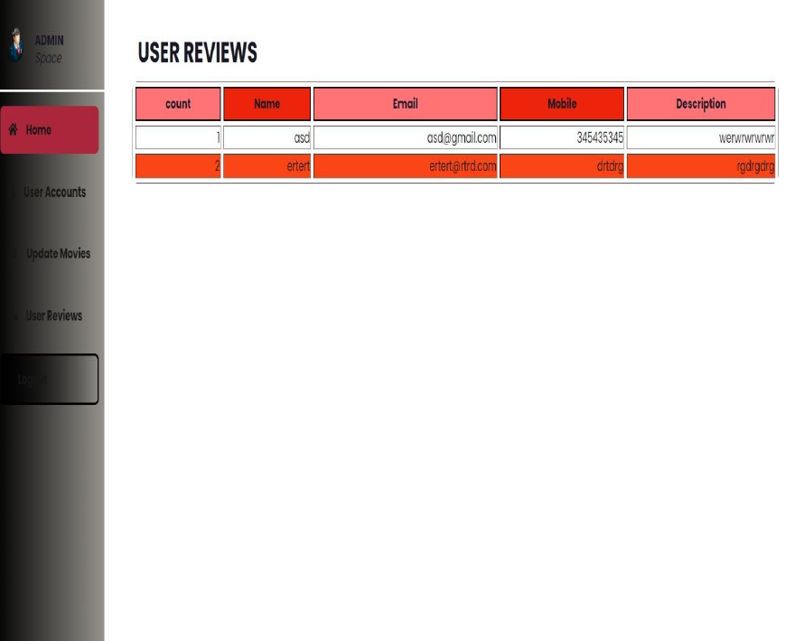
  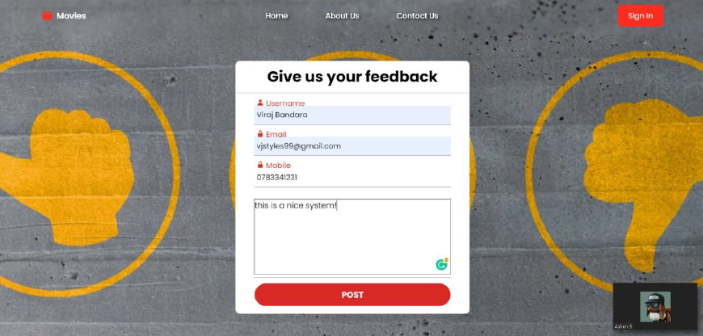
  
  <h3>⚙️ Administrative Tools</h3>
  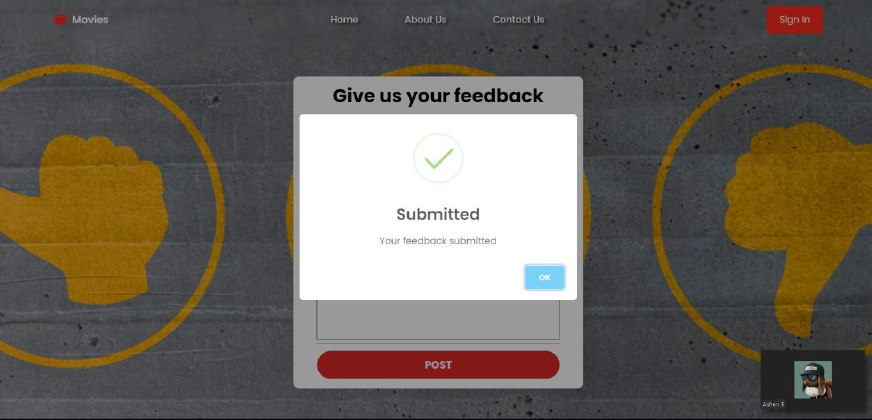
  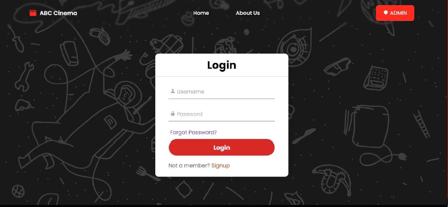
  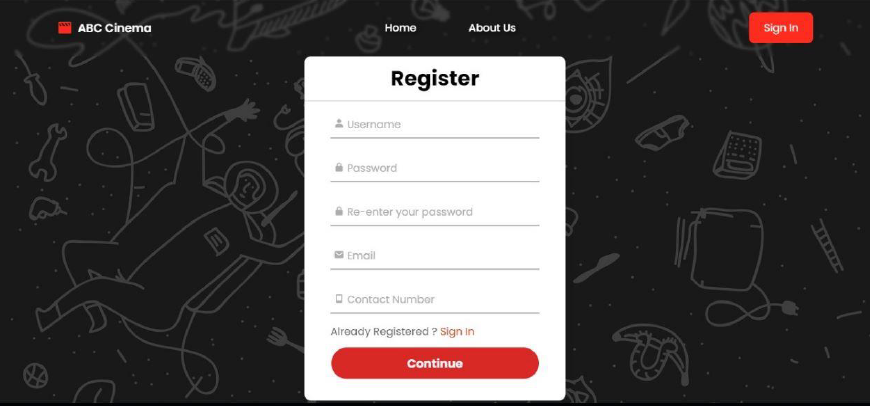
  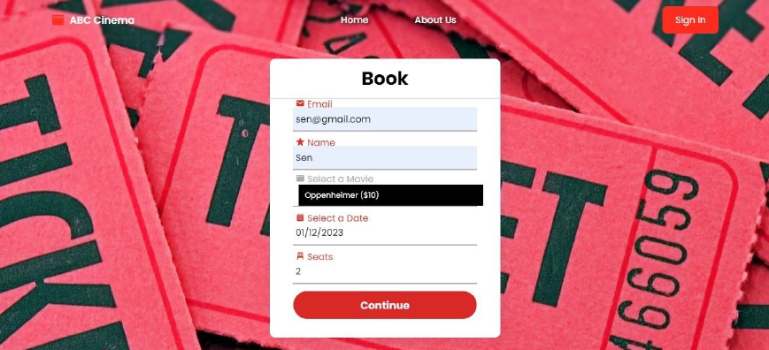
  
  <h3>📱 Additional Views</h3>
  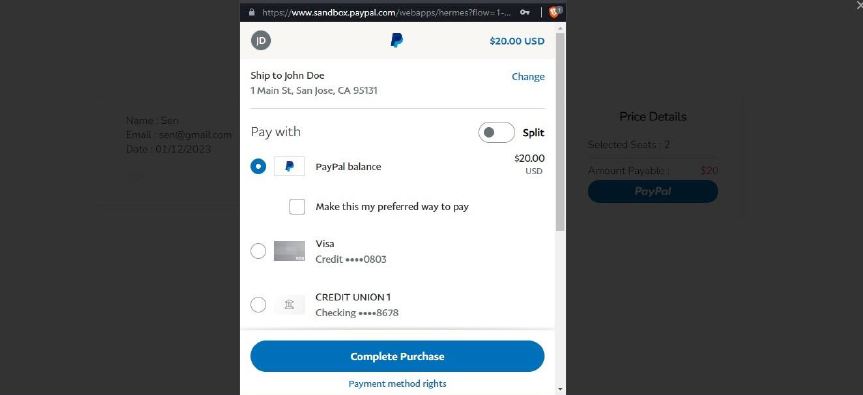
  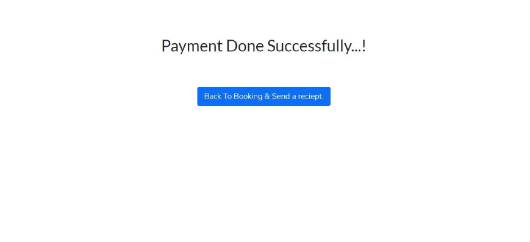
  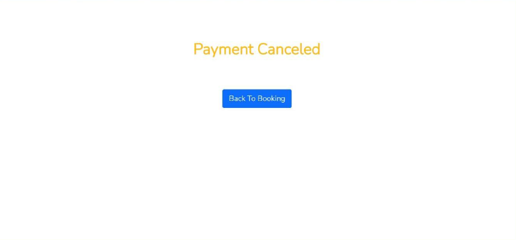
  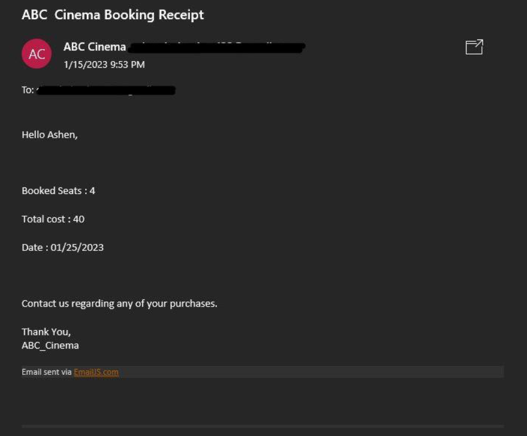
</div>

---

## 🏁 Getting Started

### Prerequisites

- JDK 8 or higher
- Apache Tomcat (or any compatible Servlet container)
- MySQL Database

### Installation

1. **Clone the repository:**
   ```bash
   git clone https://github.com/your-username/Cinema_Ticket_Reservation.git
   ```
2. **Setup Database:**
   - Import the SQL scripts located in the `database/` folder into your MySQL instance.
3. **Configure Project:**
   - Update the database connection settings in the project configuration files.
4. **Build and Deploy:**
   - Use the provided `build.xml` if you are using Ant, or deploy the web application directory to your Tomcat server.

---

## 🤝 Contributing

Contributions are welcome! Please feel free to submit a Pull Request or open an issue for any bugs or feature requests.

## 📄 License

This project is licensed under the MIT License - see the LICENSE file for details.